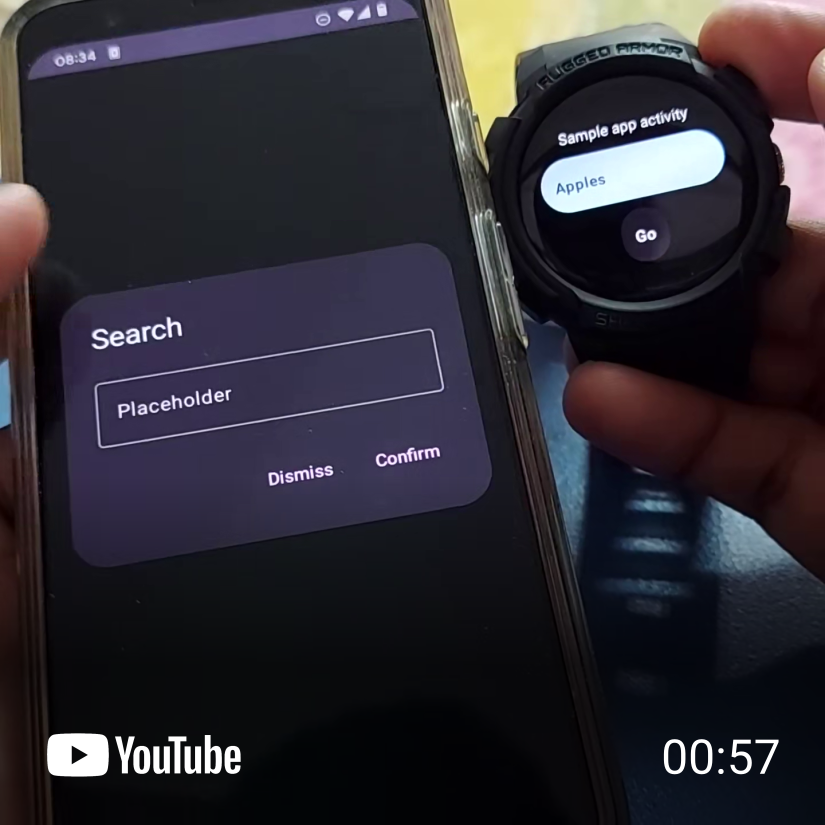

# :keyboard: Wearboard | _Truly Remote Input for WearOS_

## :speech_balloon: Background

Touch typing is a terrible idea on ant-sized watch screens albeit good swipe gesture support by Gboard. Imagine typing out a sentence composed of words outside the dictionary on a 40mm Pixel Watch -- painful, awful! :tired_face: Nevertheless, some use cases do require inputting text directly on the watch in order to maintain good UX and in such cases, it's nicer if the user can touch *"type on the phone"* to input *"text on the watch"*. :hushed:

## :computer: Project

Wearboard is an SDK that can be "plugged" into any Android / WearOS app codebase that, on click of a text box on a watch app, gives users the choice to either type on their phone or an on-screen watch keyboard to populate text fields on watch apps. :boom: The core idea is that whenever a user clicks on a text input field on a watch app, an intermediary Wearboard screen is presented asking the user to make a choice.

The project derives major inspiration from Android OS' remote input functionality for Wear OS as well as my mentor, [Gonzalo](https://www.linkedin.com/in/gonzalo-alsina-b5548a25/), for his thoughts on the subject during my summer 2023 [internship at TuneIn Inc.](https://www.linkedin.com/posts/thegeekylad_tunein-tuneininternship-gratitude-activity-7104032714558738432-9LBG?utm_source=share&utm_medium=member_desktop) :tada:

Read more about Wearboard on [my Medium](https://thegeekylad.medium.com/wearboard-truly-remote-input-for-wearos-124aae396040) :eyes: and watch a quick 1 minute demo :clapper: of Wearboard in action here:

## :bar_chart: Status

`Early Alpha v1.0`

The project is in early alpha as of today but is fully functional. I fit it the term "alpha" only because I haven't yet published a module or Maven artifact.

## :wrench: Todo

- [ ] (README) (Instructions) Importing project files
- [ ] (README) (Instructions) A placeholder code snippet of the `WearboardMaster` composable
- [ ] (Project) Structure sample app for better visibility of SDK usage
- [ ] (Project) Include a brand logo